# ✈ HELIOS ++
[](https://zenodo.org/badge/latestdoi/331344393) [](https://github.com/3dgeo-heidelberg/helios/issues) [](https://github.com/3dgeo-heidelberg/helios/blob/main/LICENSE.md) [](https://github.com/3dgeo-heidelberg/helios/commits) [](https://github.com/3dgeo-heidelberg/helios/releases)
[](https://github.com/3dgeo-heidelberg/helios/actions)

> Heidelberg LiDAR Operations Simulator ++


HELIOS++ is a general-purpose Python package for simulation of terrestrial, mobile and airborne laser scanning surveys written in C++11. 
It is developed and maintained by the [3DGeo Research Group](https://uni-heidelberg.de/3dgeo) at Heidelberg University.

## 💻 Installation

### Conda installation

The recommended way to install HELIOS++ is via the [conda package manager](https://docs.conda.io/en/latest/).

The following software is required for installation of HELIOS++:
* a Conda installation. We recommend [mamba](https://mamba.readthedocs.io/en/latest/installation/mamba-installation.html), [micromamba](https://mamba.readthedocs.io/en/latest/installation/micromamba-installation.html), or [miniconda](https://docs.anaconda.com/free/miniconda/).

HELIOS++ can then be installed with:

```bash
conda install -c conda-forge helios
```

### Standalone Installer

You can also install HELIOS++ via the standalone installers available for Windows, Linux and MacOS. They will not only install HELIOS++ but also add shortcuts for a) a H++ terminal session and b) a H++ Jupyter session.

Download the correct installer for your operating system from the [release page](https://github.com/3dgeo-heidelberg/helios/releases) and run it (under Windows, this is a setup wizard, under Linux and MacOS, it is a shell script).

### Development installation

If you intend to contribute to the development of HELIOS++, we recommend a locally compiled version using these instructions:

```bash
git clone https://github.com/3dgeo-heidelberg/helios.git
cd helios
conda env create -f environment-dev.yml
conda activate helios-dev

# On Linux, the following line is recommended, to go with a Conda-provided compiler.
# We had issues with incompatible system compilers before.
conda install -c conda-forge gcc gxx

python -m pip install --no-build-isolation --config-settings=build-dir="build" -v -e .
```

This will install the HELIOS++ Python package in editable mode and expose the
CMake build directory used as `build` (adapt as needed). Additional CMake variables
can be passed with e.g. `--config-settings=cmake.define.BUILD_TESTING="ON"`.

## ℹ Documentation

As a starting point, please consult the [wiki](https://github.com/3dgeo-heidelberg/helios/wiki/First-steps). 
We suggest you take the "first steps" tour to get to know the core concepts of the software.

Official website: https://uni-heidelberg.de/helios

For scientific and collaboration inquiries please contact the HELIOS++ team at helios@uni-heidelberg.de

We have also published two papers on HELIOS++. If you use HELIOS++ in a scientific context, please cite one of the following:

- General description of the framework:
> Winiwarter, L., Esmorís Pena, A., Weiser, H., Anders, K., Martínez Sanchez, J., Searle, M., Höfle, B. (2022): **Virtual laser scanning with HELIOS++: A novel take on ray tracing-based simulation of topographic full-waveform 3D laser scanning**. _Remote Sensing of Environment_, 269, doi:10.1016/j.rse.2021.112772

BibTeX:
```
article{heliosPlusPlus,
title = {Virtual laser scanning with HELIOS++: A novel take on ray tracing-based simulation of topographic full-waveform 3D laser scanning},
journal = {Remote Sensing of Environment},
year = {2022},
volume = {269},
issn = {0034-4257},
doi = {https://doi.org/10.1016/j.rse.2021.112772},
url = {https://www.sciencedirect.com/science/article/pii/S0034425721004922},
author = {Lukas Winiwarter and Alberto Manuel {Esmorís Pena} and Hannah Weiser and Katharina Anders and Jorge {Martínez Sánchez} and Mark Searle and Bernhard Höfle},
keywords = {Software, LiDAR simulation, Point cloud, Data generation, Voxel, Vegetation modelling, Diffuse media}
} 
```

- High performance computing:
> Esmorís, A. M., Yermo, M., Weiser, H., Winiwarter, L., Höfle, B., Rivera, F. F. (2022): **Virtual LiDAR Simulation as a High Performance Computing Challenge: Toward HPC HELIOS++**. _IEEE Access_, 10, doi:10.1109/ACCESS.2022.3211072

BibTeX:
```
@Article{Esmoris2022_HPC-HELIOS,
  author={Esmorís, Alberto M. and Yermo, Miguel and Weiser, Hannah and Winiwarter, Lukas and Höfle, Bernhard and Rivera, Francisco F.},
  journal={IEEE Access},
  title={Virtual LiDAR Simulation as a High Performance Computing Challenge: Toward HPC HELIOS++},
  year={2022},
  volume={10},
  issn = {2169-3536},
  pages={105052--105073},
  doi={https://doi.org/10.1109/ACCESS.2022.3211072},
  url={https://ieeexplore.ieee.org/document/9906068}
}
```

## 🎮 Examples

### Demo Notebooks
|                                                                                                                                                      |   |
|------------------------------------------------------------------------------------------------------------------------------------------------------|---|
| [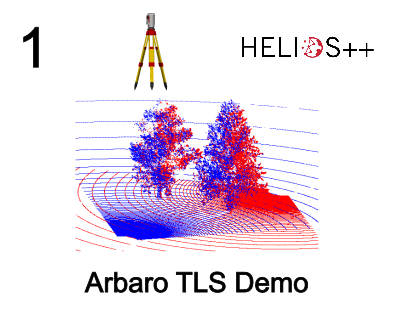](https://nbviewer.org/github/3dgeo-heidelberg/helios/blob/main/example_notebooks/1-tls_arbaro.ipynb)   | [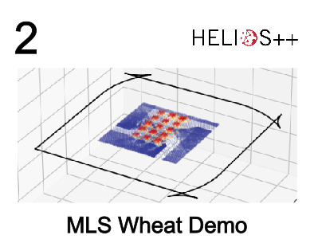](https://nbviewer.org/github/3dgeo-heidelberg/helios/blob/main/example_notebooks/2-mls_wheat.ipynb)            |
| [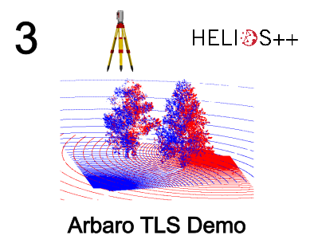](https://nbviewer.org/github/3dgeo-heidelberg/helios/blob/main/example_notebooks/3-mls_toyblocks.ipynb)   | [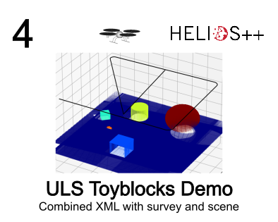](https://nbviewer.org/github/3dgeo-heidelberg/helios/blob/main/example_notebooks/4-uls_toyblocks_surveyscene.ipynb)            |
| [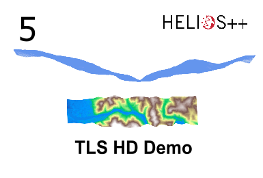](https://nbviewer.org/github/3dgeo-heidelberg/helios/blob/main/example_notebooks/5_als_hd_demo.ipynb)   | [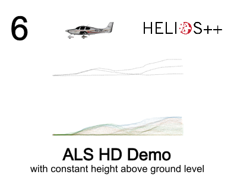](https://nbviewer.org/github/3dgeo-heidelberg/helios/blob/main/example_notebooks/6-als_hd_height_above_ground.ipynb)            |
| [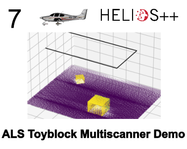](https://nbviewer.org/github/3dgeo-heidelberg/helios/blob/main/example_notebooks/7-tls_sphere_xyzloader.ipynb)   | [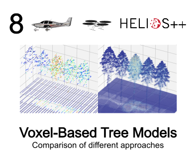](https://nbviewer.org/github/3dgeo-heidelberg/helios/blob/main/example_notebooks/8-als_uls_detailed_voxel.ipynb)            |
| [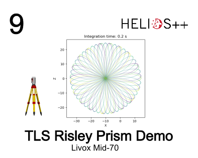](https://nbviewer.org/github/3dgeo-heidelberg/helios/blob/main/example_notebooks/9-tls_livox_demo.ipynb)   | [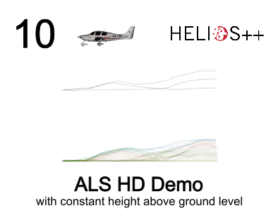](https://nbviewer.org/github/3dgeo-heidelberg/helios/blob/main/example_notebooks/10-uls_toyblocks_livox.ipynb)            |
| [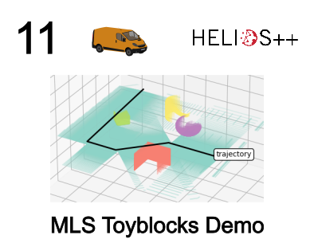](https://nbviewer.org/github/3dgeo-heidelberg/helios/blob/main/example_notebooks/11-als_toyblock_multi_scanner_livox.ipynb)   | [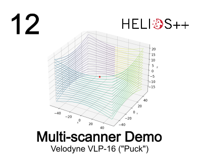](https://nbviewer.org/github/3dgeo-heidelberg/helios/blob/main/example_notebooks/12-multi_scanner_puck.ipynb)            |
| [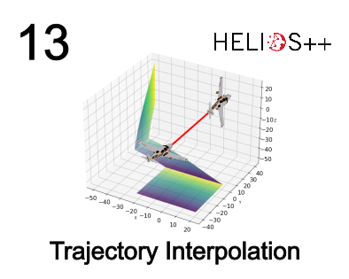](https://nbviewer.org/github/3dgeo-heidelberg/helios/blob/main/example_notebooks/13-interpolated_trajectory.ipynb)   | [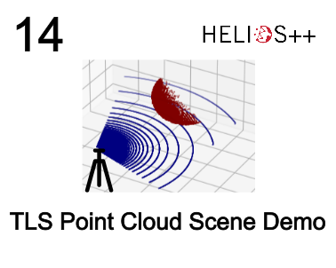](https://nbviewer.org/github/3dgeo-heidelberg/helios/blob/main/example_notebooks/14-urban_mls_dynamic.ipynb) |
| [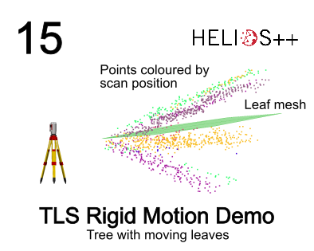](https://nbviewer.org/github/3dgeo-heidelberg/helios/blob/main/example_notebooks/15-tls_tree_dynamic.ipynb) | [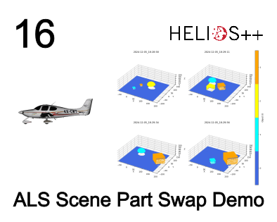](https://nbviewer.org/github/3dgeo-heidelberg/helios/blob/main/example_notebooks/16-dyn_geom_swap.ipynb) | 
[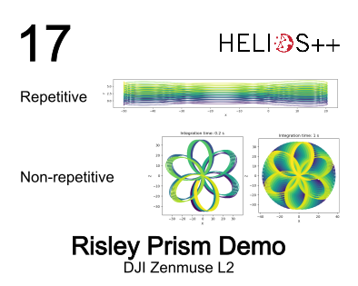](https://nbviewer.org/github/3dgeo-heidelberg/helios/blob/main/example_notebooks/17-dji-zenmuse-l2_demo.ipynb) |  |


## ⌨ Usage

### Python API

The recommended way to use HELIOS++ is via Python, as documented on ReadTheDocs: https://heliospp.readthedocs.io/


### Command line interface

From the command line, HELIOS++ can be invoked with following syntax:

```
helios --help
    Show the help for helios++ usage
    
helios --version
    Show the HELIOS++ version details

helios <survey_file_path> [OPTIONAL ARGUMENTS]
    Perform requested simulation.
    NOTICE specifying the path to the survey specification file is mandatory
```

Example to run the arboretum demo survey:

```
helios data/surveys/demo/tls_arbaro_demo.xml --format laz
```

## :gift: Related projects and Contributions

### :rocket: helios launcher

Not a fan of the command line? Check out the graphical helios launcher by [Jonathan Schellhase](https://github.com/dg-505) at [github.com/dg-505/helios-launcher](https://github.com/dg-505/helios-launcher). 
You can select the HELIOS++ installation directory and the survey path, and set additional options in a text field. Clicking the "Run" button will execute the survey and display the output in a text window. Another button opens the output folder for you. As simple as that.

### :film_strip: Blender Add-ons

#### Blender2Helios

Since December 2019, the [Blender2Helios](https://github.com/neumicha/Blender2Helios) add-on by [Michael Neumann](https://github.com/neumicha) allows easy conversion of Blender scenes to HELIOS++ scenes. Semantic labels are also supported and can be combined easily by using collections in Blender. 

#### dyn_b2h

Our two own Blender add-ons allow you to export animated Blender scenes to HELIOS++, providing an interface to probably the most popular free and open source 3D software. `dyn_b2h` exports a Blender animation to a dynamic HELIOS++ scene with rigid motions, while `multi_epoch_b2h` exports static snapshots of the animation, creating a time series of HELIOS++ scenes. The add-ons include exporting scene part OBJ files and writing scene XML files, and can also be used for static scenes. Download the add-ons from the [GitHub repo](https://github.com/3dgeo-heidelberg/dyn_b2h) and get started!

### :earth_africa: QGIS Plugin

Our QGIS Plugin AEOS embeds HELIOS++ into one of the most widely used GIS applications. It enables the creation of HELIOS++ surveys using QGIS vector and raster layers and the subsequent execution of the surveys, with direct availability of the results in the form of a QGIS point cloud layer. Crucially, it allows for instant visualisation of both the input and output of a HELIOS++ simulation within a familiar user interface, thereby greatly improving ease of use. In Greek mythology, Aeos is the name of one of the four horses that pulls Helios' fiery chariot accross the sky. Feel free to download AEOS from its own [GitHub repo](https://github.com/3dgeo-heidelberg/aeos) and add it to your arsenal of QGIS plugins now!

## :palms_up_together: Contributing

If you want to contribute to our project and make it better, your help is very welcome. Read the [Contribution Guide](https://github.com/3dgeo-heidelberg/helios/blob/main/CONTRIBUTING.md) to get started.

## 📜 License

See [LICENSE.md](LICENSE.md)
