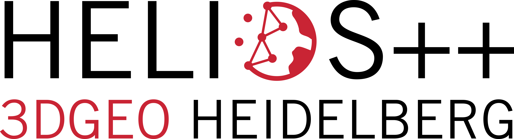

# HELIOS ++
[](https://zenodo.org/badge/latestdoi/331344393)    
> Heidelberg LiDAR Operations Simulator ++



HELIOS++ is a general-purpose software package for simulation of terrestrial, mobile and airborne laser scanning surveys written in C++11. 
It is developed and maintained by the [3DGeo Research Group](https://uni-heidelberg.de/3dgeo) at Heidelberg University.

## Download

Precompiled versions for Windows and Linux are available under [releases](https://github.com/3dgeo-heidelberg/helios/releases).

## Documentation

As a starting point, please consult the [wiki](https://github.com/3dgeo-heidelberg/helios/wiki/First-steps). 
We suggest you take the "first steps" tour to get to know the core concepts of the software.

Official website: https://uni-heidelberg.de/helios

For scientific and collaboration inquiries please contact the HELIOS++ team at helios@uni-heidelberg.de

We have also published a preprint on HELIOS++. If you use HELIOS++ in a scientific context, please cite

```
tba
```

## Usage

HELIOS++ can be invoked with following syntax:

```
helios --help
    Show the help for helios++ usage

helios --test
    Perform necessary tests to check everything works as expected

helios <survey_file_path> [OPTIONAL ARGUMENTS]
    Perform requested simulation.

    NOTICE specifying the path to the survey specification file is mandatory

    Available general OPTIONAL ARGUMENTS are:
        --assets <directory_path>
            Specify the path to assets directory
        --output <directory_path>
            Specify the path to output directory
        --writeWaveform
            Specify the full waveform must be written
        --calcEchowidth
            Specify the full waveform must be fitted
        --fullwaveNoise
            Enable random noise at full waveform computation
        --fixedIncidenceAngle
            Sets incidence angle to exactly 1.0 for all intersections
        --seed <seed>
            Specify the seed to be used for randomness generation.
            The seed can be an integer number, a decimal number or a timestamp
            string with format "YYYY-mm-DD HH:MM:SS"
        --lasOutput
            Specify the output point cloud must be generated using LAS format
        --zipOutput
            Specify the output point cloud and fullwave must be zipped
        --lasScale
            Specify the scale factor used to generate LAS output
        -j OR --njobs OR --nthreads <integer>
            Specify the number of simultaneous threads to be used to compute
            the simulation
            If it is not specified or it is specified as 0, then all available
            threads will be used to compute the simulation
        --rebuildScene
            Force scene rebuild even when a previosly built scene is available
        --disablePlatformNoise
            Disable platform noise, no matter what is specified on XML files
        --disableLegNoise
            Disable leg noise, no matter what is specified on XML files

    Available logging verbosity OPTIONAL ARGUMENTS are:
        --silent
            Nothing will be reported
        -q OR --quiet
            Only errors will be reported
        -v
            Errors, information and warnings will be reported
        -vv OR -v2
            Everything will be reported
        IF NONE IS SPECIFIED
            Errors and information will be reported by default

    Available logging output mode OPTIONAL ARGUMENTS are:
        --logFile
            Reports will be emitted through standard output and output file
        --logFileOnly
            Reports will be emitted through output file only
        IF NONE IS SPECIFIED
            Reports will be emitted through standard output only

    Unzip compressed output:
        --unzip <input_path> <output_path>
            When helios++ is executed with --zipOutput flag, output files are
            compressed. They can be decompressed using --unzip.
            The path to a readable helios++ compressed output file must be
            given through input path.
            The path to a writable file/location must be given through
            output path.
```

The demo simulation can be executed as follows:

**LINUX**
```
./helios data/surveys/demo/tls_arbaro_demo.xml
```

**WINDOWS**
```
helios.exe data/surveys/demo/tls_arbaro_demo.xml
```


## Building from source

Build instructions for advanced users and developers are available [here](BUILDME.md).

## License

See [LICENSE.md](LICENSE.md)
