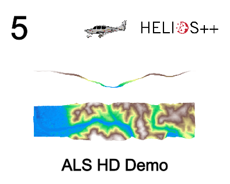
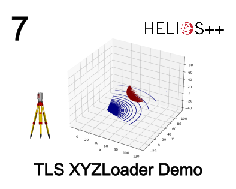
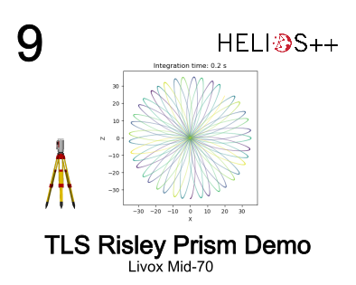
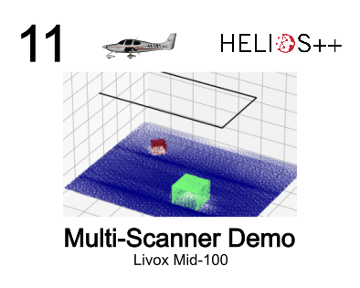
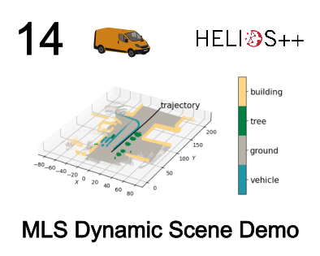
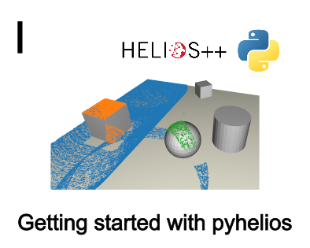

# ✈ HELIOS ++
[](https://zenodo.org/badge/latestdoi/331344393) [](https://github.com/3dgeo-heidelberg/helios/issues) [](https://github.com/3dgeo-heidelberg/helios/blob/main/LICENSE.md) [](https://github.com/3dgeo-heidelberg/helios/commits) [](https://github.com/3dgeo-heidelberg/helios/releases)
[](https://github.com/3dgeo-heidelberg/helios/actions)

> Heidelberg LiDAR Operations Simulator ++


HELIOS++ is a general-purpose Python package for simulation of terrestrial, mobile and airborne laser scanning surveys written in C++11. 
It is developed and maintained by the [3DGeo Research Group](https://uni-heidelberg.de/3dgeo) at Heidelberg University.

## 💻 Installation

### Conda installation

The recommended way to install HELIOS++ is via the [conda package manager](https://docs.conda.io/en/latest/).

The following software is required for installation of HELIOS++:
* a Conda installation. We recommend [mamba](https://mamba.readthedocs.io/en/latest/installation/mamba-installation.html), [micromamba](https://mamba.readthedocs.io/en/latest/installation/micromamba-installation.html), or [miniconda](https://docs.anaconda.com/free/miniconda/).

HELIOS++ can then be installed with:

```bash
conda install -c conda-forge helios
```

### Standalone Installer

You can also install HELIOS++ via the standalone installers available for Windows, Linux and MacOS. They will not only install HELIOS++ but also add shortcuts for a) a H++ terminal session and b) a H++ Jupyter session.

Download the correct installer for your operating system from the [release page](https://github.com/3dgeo-heidelberg/helios/releases) and run it (under Windows, this is a setup wizard, under Linux and MacOS, it is a shell script).

### Development installation

If you intend to contribute to the development of Helios++, we recommend a locally compiled version using these instructions:

```bash
git clone https://github.com/3dgeo-heidelberg/helios.git
cd helios
conda env create -f environment-dev.yml
conda activate helios-dev

# On Linux, the following line is recommended, to go with a Conda-provided compiler.
# We had issues with incompatible system compilers before.
conda install -c conda-forge gcc gxx

python -m pip install --no-build-isolation --config-settings=build-dir="build" -v -e .
```

This will install the Helios++ Python package in editable mode and expose the
CMake build directory used as `build` (adapt as needed). Additional CMake variables
can be passed with e.g. `--config-settings=cmake.define.BUILD_TESTING="ON"`.

## ℹ Documentation

As a starting point, please consult the [wiki](https://github.com/3dgeo-heidelberg/helios/wiki/First-steps). 
We suggest you take the "first steps" tour to get to know the core concepts of the software.

Official website: https://uni-heidelberg.de/helios

For scientific and collaboration inquiries please contact the HELIOS++ team at helios@uni-heidelberg.de

We have also published two papers on HELIOS++. If you use HELIOS++ in a scientific context, please cite one of the following:

- General description of the framework:
> Winiwarter, L., Esmorís Pena, A., Weiser, H., Anders, K., Martínez Sanchez, J., Searle, M., Höfle, B. (2022): **Virtual laser scanning with HELIOS++: A novel take on ray tracing-based simulation of topographic full-waveform 3D laser scanning**. _Remote Sensing of Environment_, 269, doi:10.1016/j.rse.2021.112772

BibTeX:
```
article{heliosPlusPlus,
title = {Virtual laser scanning with HELIOS++: A novel take on ray tracing-based simulation of topographic full-waveform 3D laser scanning},
journal = {Remote Sensing of Environment},
year = {2022},
volume = {269},
issn = {0034-4257},
doi = {https://doi.org/10.1016/j.rse.2021.112772},
url = {https://www.sciencedirect.com/science/article/pii/S0034425721004922},
author = {Lukas Winiwarter and Alberto Manuel {Esmorís Pena} and Hannah Weiser and Katharina Anders and Jorge {Martínez Sánchez} and Mark Searle and Bernhard Höfle},
keywords = {Software, LiDAR simulation, Point cloud, Data generation, Voxel, Vegetation modelling, Diffuse media}
} 
```

- High performance computing:
> Esmorís, A. M., Yermo, M., Weiser, H., Winiwarter, L., Höfle, B., Rivera, F. F. (2022): **Virtual LiDAR Simulation as a High Performance Computing Challenge: Toward HPC HELIOS++**. _IEEE Access_, 10, doi:10.1109/ACCESS.2022.3211072

BibTeX:
```
@Article{Esmoris2022_HPC-HELIOS,
  author={Esmorís, Alberto M. and Yermo, Miguel and Weiser, Hannah and Winiwarter, Lukas and Höfle, Bernhard and Rivera, Francisco F.},
  journal={IEEE Access},
  title={Virtual LiDAR Simulation as a High Performance Computing Challenge: Toward HPC HELIOS++},
  year={2022},
  volume={10},
  issn = {2169-3536},
  pages={105052--105073},
  doi={https://doi.org/10.1109/ACCESS.2022.3211072},
  url={https://ieeexplore.ieee.org/document/9906068}
}
```

## 🎮 Examples

### XML demos
|                                                                                                                                                      |   |
|------------------------------------------------------------------------------------------------------------------------------------------------------|---|
| [](https://nbviewer.org/github/3dgeo-heidelberg/helios/blob/dev/example_notebooks/1-tls_arbaro.ipynb)   | [](https://nbviewer.org/github/3dgeo-heidelberg/helios/blob/dev/example_notebooks/2-mls_wheat.ipynb)            |
| [](https://nbviewer.org/github/3dgeo-heidelberg/helios/blob/dev/example_notebooks/3-mls_toyblocks.ipynb)   | [](https://nbviewer.org/github/3dgeo-heidelberg/helios/blob/dev/example_notebooks/4-uls_toyblocks_surveyscene.ipynb)            |
| [](https://nbviewer.org/github/3dgeo-heidelberg/helios/blob/dev/example_notebooks/5_als_hd_demo.ipynb)   | [](https://nbviewer.org/github/3dgeo-heidelberg/helios/blob/dev/example_notebooks/6-als_hd_height_above_ground.ipynb)            |
| [](https://nbviewer.org/github/3dgeo-heidelberg/helios/blob/dev/example_notebooks/7-tls_sphere_xyzloader.ipynb)   | [](https://nbviewer.org/github/3dgeo-heidelberg/helios/blob/dev/example_notebooks/8-als_uls_detailed_voxel.ipynb)            |
| [](https://nbviewer.org/github/3dgeo-heidelberg/helios/blob/dev/example_notebooks/9-tls_livox_demo.ipynb)   | [](https://nbviewer.org/github/3dgeo-heidelberg/helios/blob/dev/example_notebooks/10-uls_toyblocks_livox.ipynb)            |
| [](https://nbviewer.org/github/3dgeo-heidelberg/helios/blob/dev/example_notebooks/11-als_toyblock_multi_scanner_livox.ipynb)   | [](https://nbviewer.org/github/3dgeo-heidelberg/helios/blob/dev/example_notebooks/12-multi_scanner_puck.ipynb)            |
| [](https://nbviewer.org/github/3dgeo-heidelberg/helios/blob/dev/example_notebooks/13-interpolated_trajectory.ipynb)   | [](https://nbviewer.org/github/3dgeo-heidelberg/helios/blob/dev/example_notebooks/14-urban_mls_dynamic.ipynb) |
| [](https://nbviewer.org/github/3dgeo-heidelberg/helios/blob/dev/example_notebooks/15-tls_tree_dynamic.ipynb) | [](https://nbviewer.org/github/3dgeo-heidelberg/helios/blob/dev/example_notebooks/16-dyn_geom_swap.ipynb) | |


### pyhelios
|                                                                                                                                                      |   |
|------------------------------------------------------------------------------------------------------------------------------------------------------|---|
| [](https://nbviewer.org/github/3dgeo-heidelberg/helios/blob/dev/example_notebooks/I-getting-started.ipynb)   | [](https://nbviewer.org/github/3dgeo-heidelberg/helios/blob/dev/example_notebooks/II-the-survey.ipynb)            |
| [](https://nbviewer.org/github/3dgeo-heidelberg/helios/blob/dev/example_notebooks/III-pyhelios_sim_and_vis.ipynb)   | [](https://nbviewer.org/github/3dgeo-heidelberg/helios/blob/dev/example_notebooks/IV-live_trajectory_plot.ipynb)            |


### Further examples

|                                                                                                                                                      |   |
|------------------------------------------------------------------------------------------------------------------------------------------------------|---|
| [](https://nbviewer.org/github/3dgeo-heidelberg/helios/blob/dev/example_notebooks/A-arboretum_notebook.ipynb)   |             |


## ⌨ Usage

HELIOS++ can be invoked with following syntax:

```
helios --help
    Show the help for helios++ usage

helios --test
    Perform necessary tests to check everything works as expected
    
helios --version
    Show the HELIOS++ version details

helios <survey_file_path> [OPTIONAL ARGUMENTS]
    Perform requested simulation.
    NOTICE specifying the path to the survey specification file is mandatory
```

```
Available general OPTIONAL ARGUMENTS are:

        --assets <directory_path>
            Specify the path to assets directory/directories
            To specify multiple paths, duplicate the argument, 
            e.g. --assets path/one --assets path/two
        --output <directory_path>
            Specify the path to output directory
        --splitByChannel
            Enable the one-file-per-device writing mode when using a
            multi-channel scanner
        --writeWaveform
            Specify the full waveform must be written
        --writePulse
            Specify pulse-wise data must be written
        --calcEchowidth
            Specify the full waveform must be fitted
        --fullwaveNoise
            Enable random noise at full waveform computation
        --fixedIncidenceAngle
            Sets incidence angle to exactly 1.0 for all intersections
        --seed <seed>
            Specify the seed to be used for randomness generation.
            The seed can be an integer number, a decimal number or a timestamp
            string with format "YYYY-mm-DD HH:MM:SS"
        --gpsStartTime <string>
            Specify the GPS start time. By default it is an empty string "",
            which means using current system time.
            It can be given as both, a posix timestamp as string or a datetime
            string with format "YYYY-MM-DD hh:mm:ss"
        --lasOutput
            Specify the output point cloud must be generated using LAS format
        --las10
            Specify to write in LAS format v1.0
        --zipOutput
            Specify the output point cloud and fullwave must be zipped
        --lasScale
            Specify the scale factor used to generate LAS output
        --parallelization <integer>
            Specify the parallelization strategy. Where 0 leads to a simple
            static/dynamic chunk based strategy and 1 leads to a warehouse
            based strategy
        -j OR --njobs OR --nthreads <integer>
            Specify the number of simultaneous threads to be used to compute
            the simulation
            If it is not specified or it is specified as 0, then all available
            threads will be used to compute the simulation
        --chunkSize <integer>
            Specify the chunk size. If it is positive, it will be used as a
            fixed size but if it is negative the absolute value will be used
            as starting size of a dynamic chunk-size based strategy.
        --warehouseFactor <integer>
            The number of tasks in the warehouse would be k times the number
            of workers. Greater factor implies less probability of idle cores
            at expenses of greater memory consumption.
        --rebuildScene
            Force scene rebuild even when a previosly built scene is available
        --noSceneWriting
            Prevent scene from being written to .scene file.
        --kdt <integer>
            Specify the type of KDTree to be built for the scene.
            Using 1 leads to the simple KDTree based on median balancing,
            2 to the SAH based KDTree, 3 for the SAH with best axis criteria
            and 4 (the default) to the fast approximation of SAH
        --kdtJobs <integer>
            Specify the number of threads to be used for building the KDTree.
            Using 1 forces sequential building, 0 as many threads as available
            cores and n>1 implies using exactly n threads.
            Using more cores than required might degrade performance due to
            overhead.
        --kdtGeomJobs <integer>
            Specify the number of threads to be used for upper levels of
            KDTree building.
            By default it is 0, which means as many jobs as --kdtJobs
            Using 1, means no geometry-level parallelization will be used when
            building the KDTree
            Using >1, means exactly n threads will be used at geometry-level
            KDTree building
        --sahNodes <integer>
            Either how many nodes must be used by the Surface Area Heuristic
            or the number of bins for the fast approximation of SAH
        --disablePlatformNoise
            Disable platform noise, no matter what is specified on XML files
        --disableLegNoise
            Disable leg noise, no matter what is specified on XML files

    Available logging verbosity OPTIONAL ARGUMENTS are:
        --silent
            Nothing will be reported
        -q OR --quiet
            Only errors will be reported
        -vt
            Time and errors will be reported
        -v
            Errors, information and warnings will be reported
        -vv OR -v2
            Everything will be reported
        IF NONE IS SPECIFIED
            Errors and information will be reported by default

    Available logging output mode OPTIONAL ARGUMENTS are:
        --logFile
            Reports will be emitted through standard output and output file
        --logFileOnly
            Reports will be emitted through output file only
        IF NONE IS SPECIFIED
            Reports will be emitted through standard output only

    Unzip compressed output:
        --unzip <input_path> <output_path>
            When helios++ is executed with --zipOutput flag, output files are
            compressed. They can be decompressed using --unzip.
            The path to a readable helios++ compressed output file must be
            given through input path.
            The path to a writable file/location must be given through
            output path.
```

The demo simulation can be executed as follows:

```
helios data/surveys/demo/tls_arbaro_demo.xml
```

### Live visualization

To visualize a survey while running it, we can use the `helios-live` entrypoint.
Requirements: `open3d` (currently only supported for Python versions 3.8, 3.9, 3.10 and 3.11)

```
helios-live data/surveys/demo/tls_arbaro_demo.xml -o3d
```


## :gift: Related projects and Contributions

### :rocket: helios launcher

Not a fan of the command line? Check out the graphical helios launcher by [Jonathan Schellhase](https://github.com/dg-505) at [github.com/dg-505/helios-launcher](https://github.com/dg-505/helios-launcher). 
You can select the HELIOS++ installation directory and the survey path, and set additional options in a text field. Clicking the "Run" button will execute the survey and display the output in a text window. Another button opens the output folder for you. As simple as that.

### :film_strip: Blender Add-ons

#### Blender2Helios

Since December 2019, the [Blender2Helios](https://github.com/neumicha/Blender2Helios) add-on by [Michael Neumann](https://github.com/neumicha) allows easy conversion of Blender scenes to HELIOS++ scenes. Semantic labels are also supported and can be combined easily by using collections in Blender. 

#### dyn_b2h

Our two own Blender add-ons allow you to export animated Blender scenes to HELIOS++, providing an interface to probably the most popular free and open source 3D software. `dyn_b2h` exports a Blender animation to a dynamic HELIOS++ scene with rigid motions, while `multi_epoch_b2h` exports static snapshots of the animation, creating a time series of HELIOS++ scenes. The add-ons include exporting scene part OBJ files and writing scene XML files, and can also be used for static scenes. Download the add-ons from the [GitHub repo](https://github.com/3dgeo-heidelberg/dyn_b2h) and get started!

### :earth_africa: QGIS Plugin

Our QGIS Plugin AEOS embeds HELIOS++ into one of the most widely used GIS applications. It enables the creation of HELIOS++ surveys using QGIS vector and raster layers and the subsequent execution of the surveys, with direct availability of the results in the form of a QGIS point cloud layer. Crucially, it allows for instant visualisation of both the input and output of a HELIOS++ simulation within a familiar user interface, thereby greatly improving ease of use. In Greek mythology, Aeos is the name of one of the four horses that pulls Helios' fiery chariot accross the sky. Feel free to download AEOS from its own [GitHub repo](https://github.com/3dgeo-heidelberg/aeos) and add it to your arsenal of QGIS plugins now!

## 📜 License

See [LICENSE.md](LICENSE.md)
