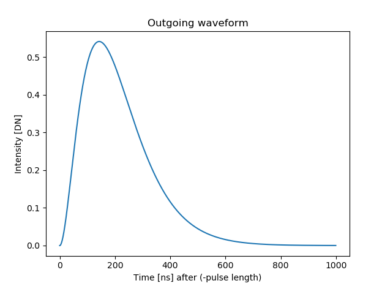
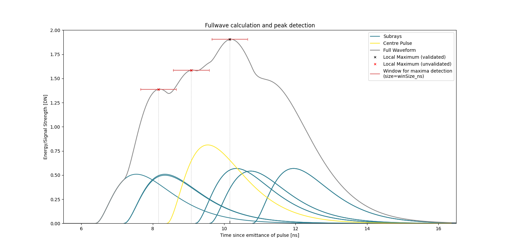
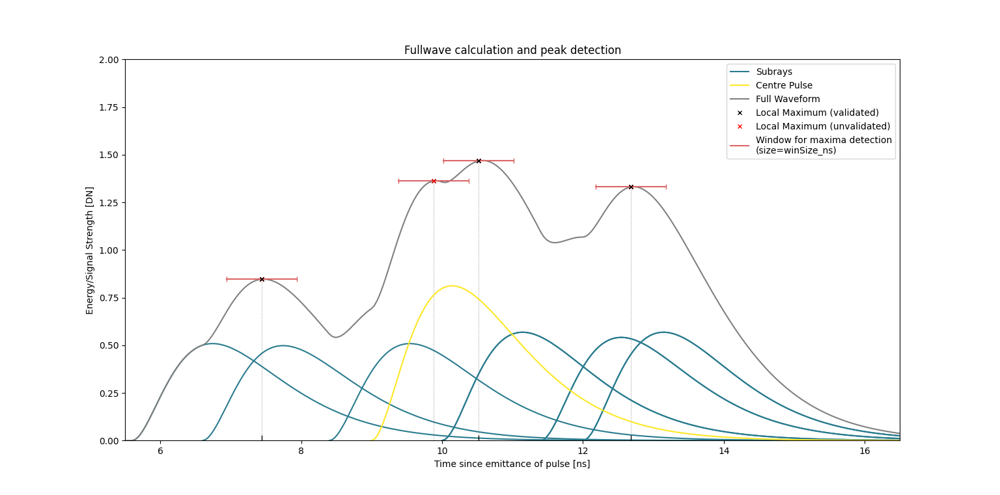
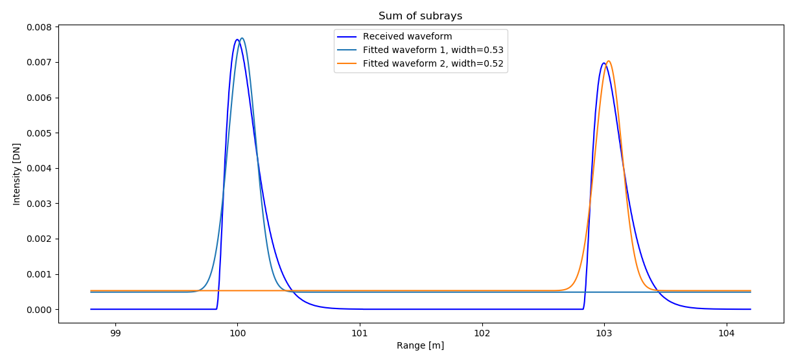

Full waveform and intensity modelling
=====================================

Fullwave processing
-------------------

HELIOS++ supports simulation of full waveform data by simulating a laser beam cone of finite divergence via sampled subrays.

Subray quantification
^^^^^^^^^^^^^^^^^^^^^

The quality of the simulation can be adjusted by the ``beamSampleQuality`` attribute of the ``<FWFSettings [...]/>`` tag in the survey XML.
If no information is given there, the scanner definition may have a set of ``FWFSettings`` instead. If this is also not present, hardcoded default values are used, as shown in the following table:

.. list-table:: HELIOS++ Pulse Sampling and Timing Parameters
   :widths: 25 20 55
   :header-rows: 1

   * - **Attribute**
     - **Default Value**
     - **Comment**

   * - ``beamSampleQuality``
     - 3
     - 3 concentric circles of subrays, 19 subrays total; discretization in space.

   * - ``binSize_ns``
     - 0.25
     - Discretization in time (in nanoseconds).

   * - ``maxFullwaveRange_ns``
     - 0
     - Maximum time to record for a single pulse. A value of 0 means no limit (wait for last pulse).

   * - ``winSize_ns``
     - ``pulseLength_ns`` / 4
     - Window size in nanoseconds; based on the ``pulseLength`` as defined in the scanner configuration.

The ``beamSampleQuality`` :math:`bSQ` is the number of concentric circles from which subrays are sampled. The angular distance of circle :math:`i` (counting from the center) depends on the beam divergence :math:`\beta` and is calculated as:

.. math::
   \theta_i = \frac{i \cdot \beta}{bSQ}

Thus, the outermost circle lies at an angular distance of :math:`\beta` (i.e., twice the beam divergence, assuming the divergence is defined at the :math:`1/e^2` energy points).

On each circle, :math:`k` subrays are sampled, where:

.. math::
   k = \left\lfloor 2\pi n \right\rfloor

The subrays are distributed evenly around the circle. The total number of subrays for a given ``beamSampleQuality`` :math:`bSQ` is:

.. math::
   n_{\text{Rays}} = 1 + \sum_{i=1}^{bSQ} \left\lfloor 2\pi i \right\rfloor

For example, with ``beamSampleQuality = 3``, the subray distribution appears as follows (color represents relative amplitude, see next section):

.. figure:: /img/polar_subsampling_grid.png
   :alt: Subray distribution for beamSampleQuality = 3
   :width: 60%
   :align: center

   Subray distribution.

.. _amplitude_evaluation:

Amplitude Evaluation
--------------------

For each subray, the returned waveform is computed by intersecting the ray with the scene. If a hit occurs, the ray does not propagate further.

The received amplitude is derived from the LiDAR equation, considering the following components:

1. **Transmitted energy**  
   The energy of a subray at a radial offset :math:`r` from the central beam is determined by the beam profile. Key parameters are:

   - :math:`w_0` ... beam waist radius (see :doc:`Scanners and platforms <scanners_platforms>`),
   - :math:`\lambda` ... wavelength,
   - :math:`r` ... radial offset from center beam,
   - :math:`R` ... target range,
   - :math:`R_0` ... minimum range (range of beam waist),
   - :math:`I_0` ... average transmitted power.

   Define the following auxiliary variables:

   .. math::
      \Omega = \frac{\lambda R}{\pi w_0^2}

   .. math::
      \Omega_0 = 1 - \frac{R}{R_0}

   .. math::
      w = w_0 \sqrt{\Omega_0^2 + \Omega^2}

   The power of the subray at offset :math:`r` is then:

   .. math::
      I = I_0 \exp\left(-\frac{2r^2}{w^2}\right)

   This model follows `Carlsson et al., 2001`_.

2. **Material reflectance**  
   The surface reflectance is modeled using Phong's Bidirectional Reflectance Distribution Function (BDRF) (Phong, 1975). 

3. **Target cross section**  
   The effective cross section is computed based on the area illuminated by the subray and the local incidence angle.

4. **Atmospheric and system efficiency**  
   Includes atmospheric attenuation and system transmission losses.

See also: :ref:`intensity-modelling`.

Time-Domain Beam Modeling
--------------------------

In the time domain, the beam pulse is modeled using the following function:

.. math::
   P(t) = t_\tau^2 \exp(-t_\tau)

where:

- :math:`t_\tau = t / \tau`,
- :math:`\tau = \text{pulseLength} / 1.75`.

This function produces the characteristic pulse shape used in the simulation (`Carlsson et al., 2001`_):

   Time-domain pulse shape :math:`P(t)` for a typical LiDAR pulse.

Calculating full waveform
-------------------------

After the subrays have been cast and intersected with the scene, they are aligned according to their range, where the maximum position (the peak in the previous figure) corresponds to the position of the return, and the waveform shape is not altered e.g. with respect to the incidence angle.
Although the central pulse and each subray are cast at the same time, they inevitably make contact with different parts of the scene, leading to a temporal offset in the returning pulses.
The waveform is the sum of these returning pulses and the maxima of this waveform are used to extract points for the output array.
The output array is created with bins of size ``binSize_ns`` and a maximum length of ``maxFullwaveRange_ns`` (if not set to 0), which starts at the first return (``pulseLength_ns`` before the hit). 
Subsequently, the recorded waveforms, scaled with their respective amplitudes are added into the array. As the bins are not necessarily aligned, they are cast to the next lowest bin.

The following two graphs illustrate the calculation and analysis of one such full waveform based on the return of one laser beam with a central pulse and six subrays which, for the sake of a simplified example, is aimed at an imaginary target at roughly 3 metres distance. 
For the output, maxima are detected using a window approach, meaning that a maximum is counted as valid if a bin has the highest value in a neighborhood of ``winSize_ns``.
The local maxima of the waveform are indicated in the graphs, along with windows for the validation of the maxima for the final return. The examples show how using full waveform can lead to more detailed and/or precise results.

   Example of a full waveform with one peak. The central pulse and six subrays are cast at the same time, but due to different ranges and incidence angles, they return at different times and with different amplitudes. The resulting waveform is the sum of these returns, and the maximum is detected as the valid return.

In the case of the first graph, the subrays are returned relatively close temporally to the central pulse. The resulting waveform has three local maxima, of which only one can be validated using the given window size (default=pulselength/4).
In consequence, this full waveform pulse would result in this one point being added to the output array, in this case at a distance of c*10.16 ns (3.05 m) to the scanner.
In comparison, the result without full waveform and evaluation of only the central pulse would have led to a less precise peak at around c*9 ns (2.7 m).

   Example of a full waveform with three peaks. The subrays are returned at more distinct times, leading to a waveform with three local maxima. The two local maxima in the center are summarised to one return due to the window size.

In the case of the second graph, the subrays are further spaced around the central pulse. This leads to the development of four local maxima, with three of them being validated and included in the output array.
In this example the increase in the number of points leads to an evident increase in detail as well as an increase in precision.

Echo width determination
------------------------

If the command line parameter ``--calcEchoWidth`` was provided, a Gaussian curve is fitted to the waveform.
This allows the determination of an echo width as the standard deviation of this Gaussian. As shown in the following figure, the maximum of the Gaussian does not align with the maximum of the pulse shape.
For the distance measurement, the position of the maximum, as detected with the window approach, is used. Note that due to the binning in the full waveform calculation,
this distance may be off by a maximum of ``binSize_ns``, which is 0.25 by default, corresponding to 7.5 cm. This offset only concerns non-first returns, though, and can be decreased by choosing a lower ``binSize_ns``.

.. _intensity-modelling:

Intensity modelling
--------------------

The laser return intensity values are calculated using the laser radar equation.

Currently, for its calculation HELIOS++ takes the following factors into account (wide table, use the scroll bar):

.. list-table:: Factors used for intensity modelling
   :widths: 20 35 20 25
   :header-rows: 1

   * - **Factor**
     - **Description**
     - **Provided by**
     - **Default Value**

   * - Average power
     - Transmitted optical power (watts)
     - User: ``averagePower_w`` in **scanner XML**
     - 4.0 W

   * - Aperture size
     - Receiver aperture diameter (meters)
     - User: ``receiverDiameter_m`` in **scanner XML**
     - 0.15 m

   * - Atmosphere transmission
     - Visibility (km)
     - User: ``atmosphericVisibility_km`` in **scanner XML**
     - 23.0 km

   * - System transmission
     - Energy passed after system inefficiency (dimensionless)
     - User: ``opticalEfficiency`` in **scanner XML**
     - 0.99

   * - Beam divergence
     - Increase of the beam diameter with increasing range (radians)
     - User: ``beamDivergence_rad`` in **scanner XML**
     - 0.0003 rad

   * - Range
     - Distance to the target (meters)
     - ``HELIOS++``
     - —

   * - Angle of incidence
     - Angle of incidence to the target (radians)
     - ``HELIOS++``
     - —

   * - Area
     - Area of the target illuminated by the beam (square meters)
     - ``HELIOS++``
     - —

   * - Reflectance
     - Reflectance of the target surface (dimensionless)
     - User: ``helios_reflectance`` in material file (`.mtl`) or ASTER
     - 50% (dimensionless)

   * - Specularity
     - Specularity of the target surface.
       Calculated as: :math:`\sum k_d / \sum (k_d + k_s)`
     - User: ``ks`` and ``kd`` in material file (`.mtl`)
     - —

   * - Specular exponent
     - Controls sharpness of specular highlights (material property)
     - User: ``Ns`` in material file (`.mtl`)
     - —

Material files
--------------

HELIOS++ supports two ways of defining materials:

1. Reading material properties from `MTL material library files`_. Following the standard, these files and their materials are linked to mesh faces using the ``mtllib`` and ``usemtl`` statements in the .OBJ file.
2. Modifying materials using the ``Material`` interface of the Python API.

Further explanations can be found here:

- Python API: `Scene - Material properties <scene.ipynb#Material-properties>`_
- Legacy XML definitions: :ref:`materials_cli`

The default material, in case no material file is provided, looks like this:

.. code-block::

    newmtl default  
    Ka 0.0 0.0 0.0  
    Kd 0.0 0.0 0.0  
    Ks 0.0 0.0 0.0  
    Ns 10  
    helios_classification 0  
    helios_reflectance 50
    helios_isGround true

.. _MTL material library files: http://paulbourke.net/dataformats/mtl/

HELIOS-specific parameters
^^^^^^^^^^^^^^^^^^^^^^^^^^

There are four HELIOS-specific parameters, that can be added to material files by inserting respective lines in the material definitions.

* ``helios_reflectance``: This parameter specifies the reflectance of the target surface using values in the range of [0, 100], e.g. ``helios_reflectance 70.8``. (default: 50.0)
* ``helios_spectra``: Instead of setting reflectance values of the materials by hand, they can be retrieved from the ECOSTRESS spectral library (formally ASTER spectral library). For each material, this library provides a file specifying its reflectance for different wavelengths in range [0, 100]. HELIOS includes a small set of these spectra in the ``python/helios/data/spectra`` folder, such as asphalt, grass, wood or gray and red shingles. More spectra can be downloaded from NASA's JPL or users can add their own spectra (resulting from spectrometer measurements). The spectra files contained in any asset directory can be referenced by their name, e.g. ``helios_spectra grass``. Now HELIOS++ will select the appropriate reflectance for the material given the wavelength of the laser. If the selected wavelength is not specified in the library (as they are discrete values) the reflectance will be interpolated. If no spectra or reflectance is specified in the .mtl, the reflectance will be set to the default and a warning will be displayed.
* ``helios_classification``: This parameter can be used to assign a classification to different sceneparts, e.g., according the ASPRS Standard (see LAS Specification p. 11), e.g. ``helios_classification 2`` for the ground. This classification will appear as an attribute of the respective simulated point reflected from that scenepart. (default: 0)
* ``helios_isGround``: Boolean parameter, which can have either values "false"/"0" or "true"/"1". If set to "true", geometries with this material are considered ground. This information is used for the ``onGround`` parameters, which can be used to translate sceneparts and platforms. (default: "true")

.. _heliospp_intensity_model:

Intensity calculation from material properties
----------------------------------------------

HELIOS++ intensity is based on Phong's Bidirectional Reflectance Distribution Function (BDRF) reflectance model coupled with the lidar-radar equation. The recorded intensity (signal amplitude) is calculated in three main steps:

1. **BDRF Calculation**

   The BDRF is computed from the material reflectance :math:`\rho` (either set via ``helios_reflectance`` in the `.mtl` file or derived from a `helios_spectra` and the scanner's wavelength) and the specularity :math:`\text{spec}` (defined by the material parameters ``kd`` :math:`(k_d)`, ``ks`` :math:`(k_s)`, and the specular exponent ``Ns`` :math:`(N_s)`). The incidence angle :math:`\varphi` is determined from the ray-object intersection.

   .. math::
      \text{BDRF}_r = \rho \cdot BDRF(\varphi, \text{spec}, N_s)

   where :math:`BDRF` follows the formulation by `Jutzi & Gross (2009) <https://doi.org/10.24406/publica-fhg-362664>`_:

   .. math::
      BDRF(\varphi, \text{spec}, N_s) = (1 - \text{spec}) \cdot \cos(\varphi) + \text{spec} \cdot \left| \cos(\varphi^*) \right|^{N_s}

   with :math:`\varphi^* = \varphi - \pi/2` if :math:`\varphi > \pi/2`, otherwise :math:`\varphi^* = \varphi`.

   The specularity :math:`\text{spec}` is computed as:

   .. math::
      \text{spec} = \frac{k_s[0] + k_s[1] + k_s[2]}{k_d[0] + k_d[1] + k_d[2] + k_s[0] + k_s[1] + k_s[2]}

   Please note:

   - If `K_s` is 0, the material is fully diffuse and the BDRF simplifies to :math:`\text{BDRF}_r = \rho \cdot \cos(\varphi)` (Lambertian reflectance).
   - If both `K_d` and `K_s` are 0, the material reflectance is direction-independent and the BDRF simplifies to :math:`\text{BDRF}_r = \rho`.

2. **Lidar Cross Section Calculation**

   The lidar cross section :math:`\sigma` is calculated using the illuminated target area :math:`A`, following `Wagner (2010) <https://doi.org/10.1016/j.isprsjprs.2010.06.007>`_, Eq. 14. It is assumed that each sub-ray either fully hits the target or does not hit at all; partial hits are treated as full hits in intensity simulation.

   .. math::
      \sigma = 4\pi \cdot \text{BDRF}_r \cdot A \cdot \cos(\varphi)

3. **Received Intensity via Lidar-Radar Equation**

   The received intensity :math:`I` is computed using the lidar-radar equation, including atmospheric attenuation (`Carlsson et al., 2001`_):

   .. math::
      I = \frac{I_0 \cdot D_r^2 \cdot \eta_{\text{sys}} \cdot \sigma}{4\pi \cdot R^4 \cdot B_t^2 \cdot \exp\left( \frac{2\pi^2 r^2 w_0^2}{\lambda^2 (R_0^2 + R^2)} + 2 R a_e \right)} \cdot 10^9

   where:
   
   - :math:`I_0` is the average pulse intensity,
   - :math:`D_r` is the receiver diameter,
   - :math:`\eta_{\text{sys}}` is the system efficiency,
   - :math:`R` is the target range,
   - :math:`r` is the sub-ray radius (distance from the central sub-ray),
   - :math:`B_t` is the beam divergence,
   - :math:`w_0` is the beam waist radius,
   - :math:`\lambda` is the scanner wavelength,
   - :math:`R_0` is the beam waist range (minimum range),
   - :math:`a_e` is the atmospheric extinction coefficient, computed as:

   .. math::
      a_e = \frac{3.91}{V_M} \left( \frac{\lambda}{0.55} \right)^{-q}

   with the exponent :math:`q` defined piecewise:

   .. math::
      q = 
      \begin{cases}
        1.6, & \text{if } V_M > 50\ \text{km} \\
        1.3, & \text{if } 50\ \text{km} > V_M > 6\ \text{km} \\
        0.585 \cdot V_M^{0.33}, & \text{otherwise}
      \end{cases}

   where :math:`V_M` is the atmospheric visibility.

.. _Carlsson et al., 2001: https://www.foi.se/rest-api/report/FOI-R--0163--SE