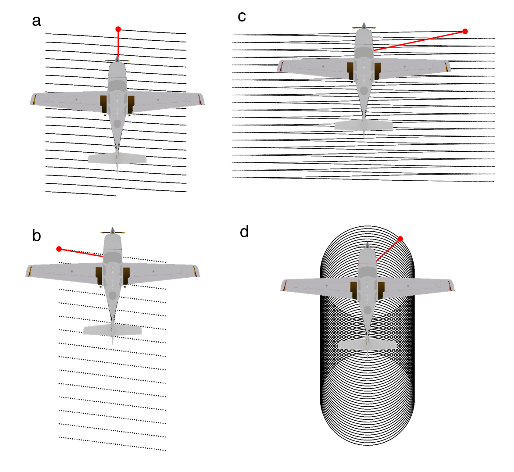
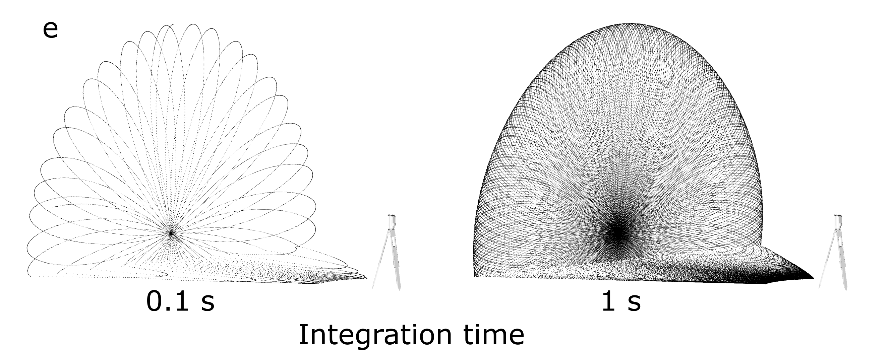
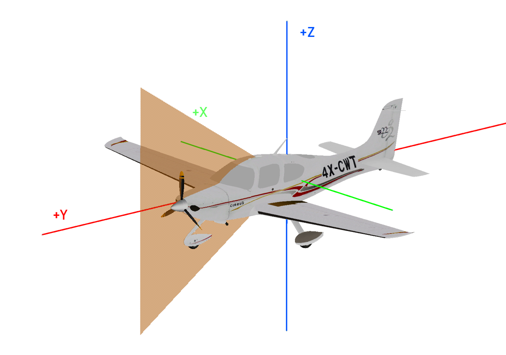
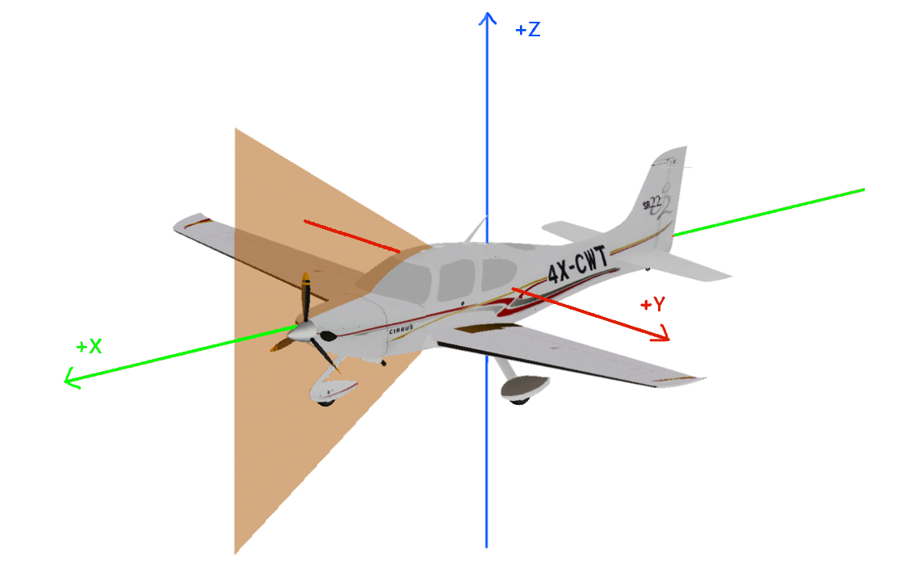

Scanners and platforms
======================

HELIOS comes with a list of pre-defined scanners and platforms that are configured using XML files. These can be found in `python/helios/data`.
Users can also create their own scanners by definining them via XML files and providing the asset path where HELIOS can find them.
They can then be selected by their unique ID at creation of the survey, either in the Python API or in the survey XML file.

Scanner system definitions
--------------------------

Built-in scanners are defined in the two XML files ``scanners_als.xml`` and ``scanners_tls.xml`` that are shipped with the Python package.
Here is an example definition for the RIEGL VUX-1UAV:

.. code-block:: xml

  <!-- ##### BEGIN RIEGL VZ-600i ##### -->    
  <scanner  id                         = "riegl_vz600i"
            name                       = "RIEGL VZ-600i"
            accuracy_m                 = "0.005"
            beamDivergence_rad         = "0.00035"
            headRotatePerSecMax_deg    = "360"
            optics                     = "rotating"
            pulseFreqs_Hz              = "140000,600000,1200000,2200000"
            pulseLength_ns             = "5"
            rangeMin_m                 = "0.5"
            scanAngleMax_deg           = "52.5"
            scanAngleEffectiveMax_deg  = "52.5"
            scanFreqMin_Hz             = "4"
            scanFreqMax_Hz             = "420">
      
      <FWFSettings beamSampleQuality="3"/>    
      <beamOrigin x="0" y="0" z="0.2">
          <rot axis="y" angle_deg="0" />
          <rot axis="z" angle_deg="0" />
          <rot axis="x" angle_deg="0" />
      </beamOrigin>
      <headRotateAxis x="0" y="0" z="1"/>
      
  </scanner>
  <!-- ##### END RIEGL VZ-600i ##### -->

Within the ``<scanner>`` tag, sensor specifications are given. The two basic ones are:

* ``id``: the scanner ID. It is used to reference it in the survey file.
* ``name``: name of the scanner

Then there are parameters for the the emittor, the deflector, the detector, the scanner head and fullwave settings. 

**Emitter**:

* ``beamDivergence_rad``: The full-angle beam divergence at the :math:`1/e^2` intensity points, in radians (default: 0.0003 rad).

  If a technical specification provides the beam divergence at the :math:`1/e` power points or at 50% peak intensity (i.e., Full Width at Half Maximum, FWHM), it must be converted to the :math:`1/e^2` reference using the following relationships:

  .. math::
     \theta_{1/e^2} = \sqrt{2} \cdot \theta_{1/e}

  .. math::
     \theta_{1/e^2} = \frac{2 \cdot \text{FWHM}}{\sqrt{2 \ln 2}}

  These conversions are based on the Gaussian beam profile assumption, where the intensity follows a Gaussian distribution.

* ``pulseFreqs_Hz``: List of supported pulse frequency or frequencies [Hz].
* ``pulseLength_ns``: Laser pulse length/duration [ns] (default: 4.0).
* ``wavelength_nm``: Wavelength [nm] (default: 1064).
* ``averagePower_w``: The average power emitted by the laser. Integrating the whole footprint will give this power [W] (default: 4.0).

**Deflector**:

- ``optics``: Laser beam deflector. The supported deflectors are:
    - **(a)** rotating mirror (``rotating``)
        - with the optional parameter ``scanAngleEffectiveMax_deg``
    - **(b)** fiber array (``line``)
        - with the optional parameter ``numFibers``
    - **(c)** oscillating mirror (``oscillating``) 
        - with the optional parameter ``scanProduct``. The maximum scan product determines the maximum scanner velocity. It is the product of the maximum scan rate and maximum scan angle, which are inversely proportional to each other (Ussyshkin et al. 2008). 
    - **(d)** conic mirror (``conic``)
        - note that the parameter scan angle in the scanner settings of a survey XML is not used for this beam deflector because this scanner type does not have a selectable scan angle. The ``maxScanAngle_deg`` defined in the scanner XML is used as half-opening angle of the cone.
    - **(e)** risley prims (``risley``)
        - with the parameters ``rotorFreq1_Hz``, ``rotorFreq2_Hz`` and ``rotorFreq3_Hz``, i.e., the rotational speeds of the two prisms, ``angle1_deg``, ``angle2_deg`` and ``angle3_deg``, i.e., the prism angles, and ``refrIndex1``, ``refrIndex2``, ``refrIndex3`` and ``refrIndex_air``.
        - note that the parameters ``scanFreq_Hz`` and ``scanAngle_deg`` are not used for this deflector.

    Figure: Different scan patterns supported by HELIOS++.

- ``scanAngleMax_deg``: Maximum possible scan angle [deg], defined as half-angle. For conic ("Palmer-") scanners, this parameter determines the half-opening angle of the conical scan pattern.
- ``scanAngleEffectiveMax_deg``: Effective maximum possible scan angle [deg] - only for rotating mirrors. If a data sheet provides an "effective measurement rate" different from the pulse repetition rate (PRR) (pulse frequency), obtain the ratio of PRR to effective measurement rate. Multiply the maximum scan angle (as in the data sheet) with this ratio to obtain the ``scanAngleMax_deg`` and supply the maximum scan angle (as in the data sheet) as ``scanAngleEffectiveMax_deg``. Background: For rotating mirrors, the actual output window might be smaller than the maximum output window. The reason not to utilize the full available angular domain is that the beam has a finite size, i.e., the spot on the mirror will not "jump" from one face of the deflector to the next - resulting in scattering in not-well defined directions. The available angular domain may further be contrained by occlusions, e.g., by the casing or mounting of the scanner.
- ``scanFreqMin_Hz`` and ``scanFreqMax_Hz``: Minimum and maximum values to define the possible scan frequency range [Hz]

**Detector**:

- ``rangeMin_m``: Minimum range in m
- ``accuracy_m``: Sensor accuracy in m
- ``maxNOR``: Maximum number of returns per pulse, e.g., if maxNOR equals 1, only the first return is recorded for each pulse. If maxNOR is 0 (default), the number of returns per pulse is not limited.

**Head:**

* ``headRotatePerSecMax_deg``: Maximum speed of scanner head rotation [deg].
* Tag: ``<headRotateAxis >``: Axis around which the scanner head is rotated.
* Tag: ``<beamOrigin>``: Origin of the laser beam. The position (x,y,z coordinates) and the attitude (rotations about X,Y,Z) can be provided. The offset and rotations are defined in the same manner as for the ``scannerMount`` tag in the Platforms XML. By default, the beam origin is assumed to be in the center of the scanner, and the axes of the beam to be aligned with the axes of the scanner. The rotation defined in ``<beamOrigin>`` is applied before the one of the ``<scannerMount>`` in the Platforms XML. We suggest to use the ``beamOrigin`` rotation to point the scanner downwards and have it scan left-to-right (for airborne systems), as this is the default use case. If no rotation is provided, the scanner looks to the front of the platform and scans up-down: 

The rotation can be given in ``local`` mode by setting ``<beamOrigin [...] rotations="local">``, where axes are rotated. By default, axes are kept fixed in the ``global`` mode. Also see the :ref:`scanner-mount` section for platforms.

The x, y, z coordinates of the position of the origin of the laser beam are set in the following coordinate system: 

**FWF settings**:

These are defined in a separate tag ``<FWFSettings>``, see :doc:`fwf_settings <intensity_fwf>`.

- ``beamSampleQuality``
- ``binSize_ns``
- ``maxFullwaveRange_ns``
- ``winSize_ns``

**Other parameters**:

- ``beamQualityFactor``: How well the beam is focused. The beam waist radius :math:`w_0` is calculated as

  .. math::
     w_0 = \frac{\text{beamQualityFactor} \cdot \lambda}{\pi \cdot \text{beamDivergence}}

  and is assumed to occur at the minimum range (as defined in the scanner configuration). Do not confuse with ``beamSampleQuality``, which defines the number of subrays used (default: 1.0).

- ``opticalEfficiency``: Efficiency of the scanner, i.e. :math:`\eta_{\text{Sys}}` in the LiDAR equation (Höfle & Pfeifer, 2007) (default: 0.99).

- ``atmosphericVisibility_km``: Used to calculate atmospheric attenuation, i.e. :math:`\eta_{\text{Atm}}`, following Carlsson et al. (2001). The calculation depends on the scanner's wavelength (default: 23.0 km).

- ``receiverDiameter_m``: Unused parameter (default: 0.15 m).

With these parameters, custom scanners can be defined from scanner datasheets.
Or built-in scanners can be modified, e.g., to add a tilt mount or to change the beam divergence.

Multi-channel scanner
^^^^^^^^^^^^^^^^^^^^^

It is possible to configure a scanner to be a MultiScanner or Multi-channel scanner. First, it is necessary to have a standard scanner definition.
This specification will then be used as the default configuration for each channel.
Second, it is possible to define a `<channels>` element with as many `<channel>` elements inside as desired.
For each channel, it is possible to define almost all attributes that can be defined for a single scanner, including the optics.
Thus, it is possible to have different channels with different beam deflection methods.
The only attributes all channels must share are those related to the pulse frequency.
At the moment, HELIOS++ uses the pulse frequency to define the simulation frequency.
Therefore, it does not support channels with different pulse frequencies.

.. code-block:: xml

    <scanner ...>
        <channels>
            <channel id="0">
                <beamOrigin x="0" y="0" z="0">
                            <rot axis="z" angle_deg="-30"/>
                        </beamOrigin>
            </channel>
            <channel id="1">
                <beamOrigin x="0" y="0" z="0">
                            <rot axis="z" angle_deg="30"/>
                        </beamOrigin>
            </channel>
        </channels>
    </scanner>

The output setting ``split_by_channel`` (``--splitByChannel`` CLI argument) can be used to make multi-channel scanners write their output point clouds to a different file per channel.

Platform definition
--------------------

HELIOS++ supports static and dynamic as well as terrestrial and airborne platforms. Built-in platforms are defined in ``platforms.xml``.
Users can also define their own platforms by creating an XML file and providing the asset path where HELIOS can find it.
They can then be selected by their unique ID at creation of the survey, either in the Python API or in the survey XML file.

Static platforms
^^^^^^^^^^^^^^^^

Terrestrial laser scanning (TLS) simulations are conducted from static platforms, e.g., the `` tripod``. Per default, the ``tripod`` is mounted at a height of 1.5 m.
Each leg is considered a single scan position.

Note that for static surveys, the `` force_on_ground`` parameter (``onGround`` in the survey XML) comes in handy.
It forces the platform to be placed at ground level, where the ground is defined via the material properties.

Dynamic platforms
^^^^^^^^^^^^^^^^^

For simple trajectories defined by multiple waypoints, the ``linearpath`` platform can be used.
This platform type simply moves on a straight line from one waypoint (`leg`) to the next with a constant speed.

For more complex trajectories, interpolated trajectories can be used as demonstrated in the following notebooks: 

.. ToDo: Link to notebooks here?

.. _scanner-mount:
Scanner mount
^^^^^^^^^^^^^^

The way in which the scanner is mounted on the platform can be defined in the ``scannerMount`` tag of the Platforms XML.
The position (x,y,z coordinates) and the attitude (rotations about X,Y,Z) can be provided.
The offset and rotations are defined in the same manner as for the ``beamOrigin`` tag in the Scanners XML.

For instance, to specify a scanner that is facing down and scanning orthogonally to the platform orientation (as is the case for ALS), use:

.. code-block:: xml

    <platform id="sr22" name="Cirrus SR-22" type="linearpath">
        <scannerMount z="0.7" rotation="global">
            <rot axis="Z" angle_deg="-90" /> <!-- scan plane: left-to-right -->
            <rot axis="Y" angle_deg="90" /> <!-- main direction: downwards -->
        </scannerMount>
    </platform>

The scanner's coordinate system is defined as R-F-U, i.e. the first axis (X) is pointing to the right wingtip, the second axis (Y) is pointing towards the front of the platform and the third axis (Z) is pointing upwards, i.e. to zenith. 
For rotating mirror, fibre array and oscillating scanners, the scan plane is created by the second and the third axis, and the main scan direction is the Y-Axis (forward).
Without rotation, this results in a scan pattern normal to the horizon:

Note that there are two modes of rotation, as defined in the ``scannerMount``-Tag: ``rotations="global"``, where the axes of rotation are kept fixed in space, and ``rotations="local"``, where the axes are rotated with the scanner.
The difference is prominent when completing turns about multiple axes, and is shown in the following example. If no mode is provided, global mode assumed.

The task here is to create a scanner that looks backwards, 20° off-nadir.

.. list-table:: Rotation Effects in Global vs. Local Mode
   :widths: 20 40 40
   :header-rows: 1

   * - **Rotations**
     - **Global Mode**
     - **Local Mode**

   * - None
     - .. figure:: /img/default_orientation.png
          :alt: Global mode - No rotation
          :width: 100%
          :align: center
     - .. figure:: /img/default_orientation.png
          :alt: Local mode - No rotation
          :width: 100%
          :align: center

   * - Y-axis: 90°
     - .. figure:: /img/global_y_90.png
          :alt: Global mode - Y-axis rotation 90°
          :width: 100%
          :align: center
     - .. figure:: /img/local_y_90.png
          :alt: Local mode - Y-axis rotation 90°
          :width: 81000%
          :align: center

   * - Y-axis: 90°, X-axis: -110°
     - .. figure:: /img/global_y_90_x_neg110.png
          :alt: Global mode - Y=90°, X=-110°
          :width: 100%
          :align: center
     - .. figure:: /img/local_y_90_x_neg110.png
          :alt: Local mode - Y=90°, X=-110°
          :width: 100%
          :align: center

   * - Y-axis: 90°, Z-axis: -110°
     - .. figure:: /img/global_y_90_z_neg110.png
          :alt: Global mode - Y=90°, Z=-110°
          :width: 100%
          :align: center
     - .. figure:: /img/local_y_90_z_neg110.png
          :alt: Local mode - Y=90°, Z=-110°
          :width: 100%
          :align: center

The orange triangle shows the scan plane. Note, how the axes in the local mode change their direction with respect to the platform after every rotation. For the global mode, the following definition gives the desired result:

.. code-block:: xml

    <scannerMount x="0.0" y="0.0" z="0.0" rotations="global">		
        <rot axis="y" angle_deg="90" />	
        <rot axis="x" angle_deg="-110" />	
    </scannerMount>

and for the local mode, this definition is correct:

.. code-block:: xml

    <scannerMount x="0.0" y="0.0" z="0.0" rotations="local">		
        <rot axis="y" angle_deg="90" />	
        <rot axis="z" angle_deg="-110" />	
    </scannerMount>

Note that an **additional rotation** is applied in the scanner's ``beamOrigin`` tag, which uses the same syntax.
We suggest to use the ``beamOrigin`` rotation to point the scanner downwards and scan left-to-right (as this is the most common usecase) and the ``scannerMount`` (which is applied thereafter) for specialized mounts such as 23° off-nadir for airborne bathymetry (although this is usually solved by using a conical scan pattern with an opening angle of 46°).

.. ToDo: Platform noise?